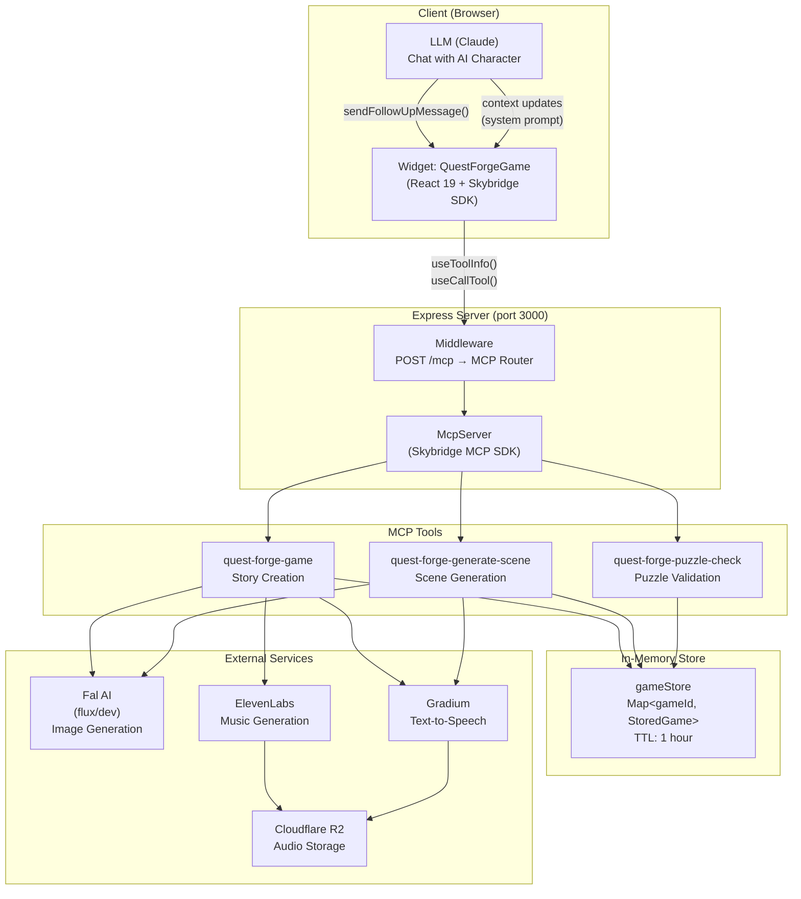
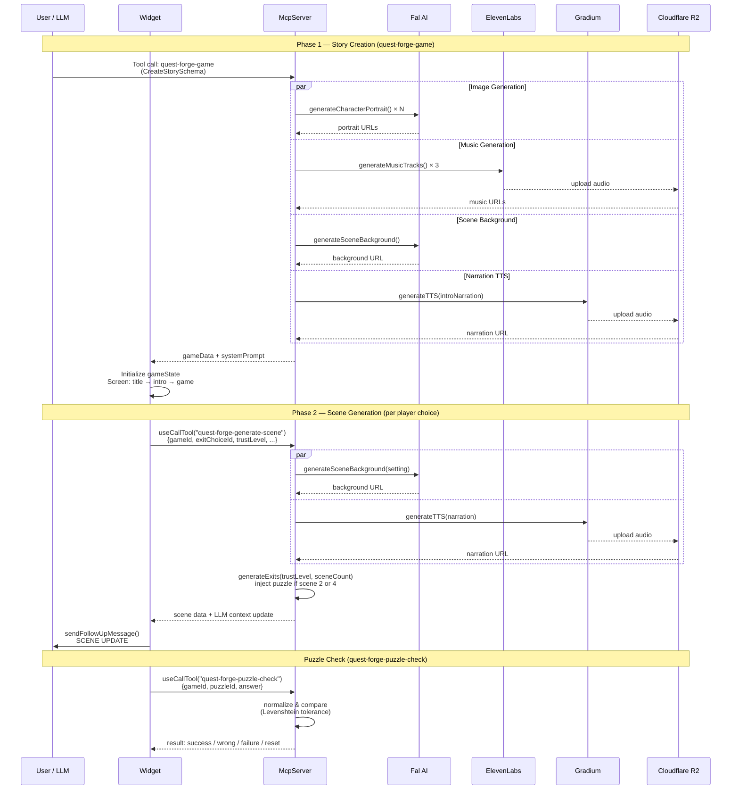
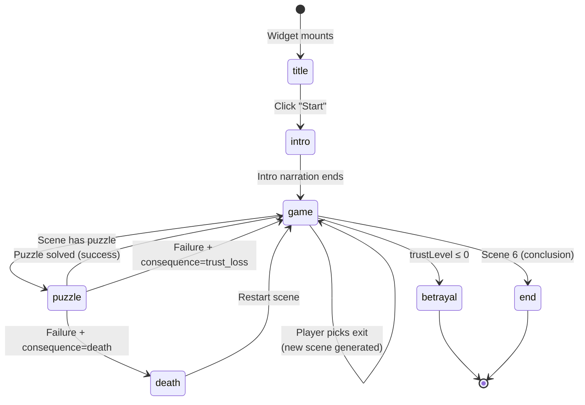
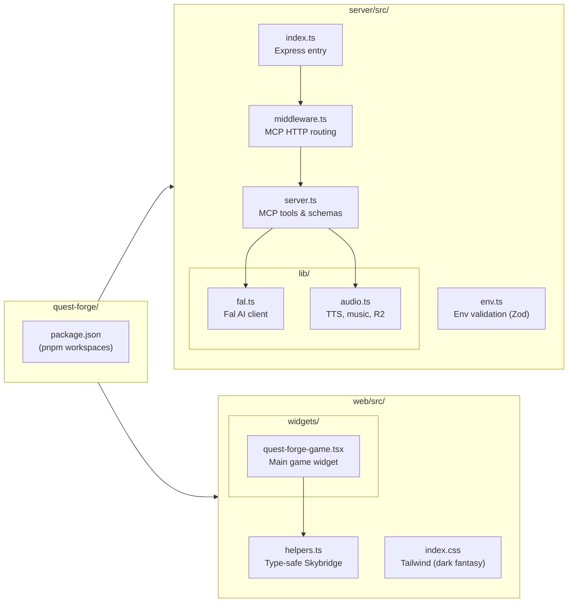
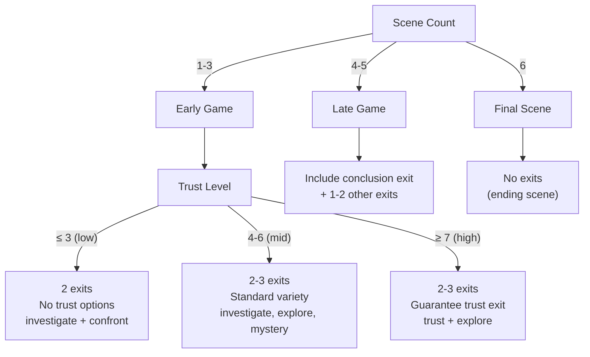

# Quest Forge — Architecture

## System Overview

```mermaid
graph TB
    subgraph Client["Client (Browser)"]
        LLM["LLM (Claude)<br/>Chat with AI Character"]
        Widget["Widget: QuestForgeGame<br/>(React 19 + Skybridge SDK)"]
    end

    subgraph Server["Express Server (port 3000)"]
        MW["Middleware<br/>POST /mcp → MCP Router"]
        MCP["McpServer<br/>(Skybridge MCP SDK)"]
    end

    subgraph Tools["MCP Tools"]
        T1["quest-forge-game<br/>Story Creation"]
        T3["quest-forge-generate-scene<br/>Scene Generation"]
        T4["quest-forge-puzzle-check<br/>Puzzle Validation"]
    end

    subgraph Store["In-Memory Store"]
        GS["gameStore<br/>Map&lt;gameId, StoredGame&gt;<br/>TTL: 1 hour"]
    end

    subgraph External["External Services"]
        FAL["Fal AI<br/>(flux/dev)<br/>Image Generation"]
        EL["ElevenLabs<br/>Music Generation"]
        GR["Gradium<br/>Text-to-Speech"]
        R2["Cloudflare R2<br/>Audio Storage"]
    end

    LLM -- "sendFollowUpMessage()" --> Widget
    Widget -- "useToolInfo()<br/>useCallTool()" --> MW
    LLM -- "context updates<br/>(system prompt)" --> Widget
    MW --> MCP
    MCP --> T1
    MCP --> T3
    MCP --> T4

    T1 --> GS
    T3 --> GS
    T4 --> GS

    T1 --> FAL
    T1 --> EL
    T1 --> GR
    T3 --> FAL
    T3 --> GR
    EL --> R2
    GR --> R2
```

## Two-Phase Tool Flow

```mermaid
sequenceDiagram
    participant U as User / LLM
    participant W as Widget
    participant S as McpServer
    participant F as Fal AI
    participant E as ElevenLabs
    participant G as Gradium
    participant R2 as Cloudflare R2

    Note over U,R2: Phase 1 — Story Creation (quest-forge-game)

    U->>S: Tool call: quest-forge-game<br/>(CreateStorySchema)
    par Image Generation
        S->>F: generateCharacterPortrait() × N
        F-->>S: portrait URLs
    and Music Generation
        S->>E: generateMusicTracks() × 3
        E-->>R2: upload audio
        R2-->>S: music URLs
    and Scene Background
        S->>F: generateSceneBackground()
        F-->>S: background URL
    and Narration TTS
        S->>G: generateTTS(introNarration)
        G-->>R2: upload audio
        R2-->>S: narration URL
    end
    S-->>W: gameData + systemPrompt
    W->>W: Initialize gameState<br/>Screen: title → intro → game

    Note over U,R2: Phase 2 — Scene Generation (per player choice)

    W->>S: useCallTool("quest-forge-generate-scene")<br/>{gameId, exitChoiceId, trustLevel, ...}
    par
        S->>F: generateSceneBackground(setting)
        F-->>S: background URL
    and
        S->>G: generateTTS(narration)
        G-->>R2: upload audio
        R2-->>S: narration URL
    end
    S->>S: generateExits(trustLevel, sceneCount)<br/>inject puzzle if scene 2 or 4
    S-->>W: scene data + LLM context update
    W->>U: sendFollowUpMessage()<br/>SCENE UPDATE

    Note over U,R2: Puzzle Check (quest-forge-puzzle-check)

    W->>S: useCallTool("quest-forge-puzzle-check")<br/>{gameId, puzzleId, answer}
    S->>S: normalize & compare<br/>(Levenshtein tolerance)
    S-->>W: result: success / wrong / failure / reset
```

## Game State Machine

```mermaid
stateDiagram-v2
    [*] --> title: Widget mounts

    title --> intro: Click "Start"
    intro --> game: Intro narration ends

    game --> puzzle: Scene has puzzle
    game --> game: Player picks exit<br/>(new scene generated)
    game --> betrayal: trustLevel ≤ 0
    game --> end: Scene 6 (conclusion)

    puzzle --> game: Puzzle solved (success)
    puzzle --> death: Failure + consequence=death
    puzzle --> game: Failure + consequence=trust_loss

    death --> game: Restart scene

    betrayal --> [*]
    end --> [*]
```

## Directory Structure

```mermaid
graph LR
    subgraph Root["quest-forge/"]
        PJ["package.json<br/>(pnpm workspaces)"]
    end

    subgraph ServerPkg["server/src/"]
        IDX["index.ts<br/>Express entry"]
        SRV["server.ts<br/>MCP tools & schemas"]
        MWR["middleware.ts<br/>MCP HTTP routing"]
        ENV["env.ts<br/>Env validation (Zod)"]
        subgraph Lib["lib/"]
            FALTS["fal.ts<br/>Fal AI client"]
            AUDIO["audio.ts<br/>TTS, music, R2"]
        end
    end

    subgraph WebPkg["web/src/"]
        subgraph Widgets["widgets/"]
            GAME["quest-forge-game.tsx<br/>Main game widget"]
        end
        HELP["helpers.ts<br/>Type-safe Skybridge"]
        CSS["index.css<br/>Tailwind (dark fantasy)"]
    end

    Root --> ServerPkg
    Root --> WebPkg
    IDX --> MWR
    MWR --> SRV
    SRV --> FALTS
    SRV --> AUDIO
    GAME --> HELP
```

## Exit Generation Heuristics

```mermaid
graph TD
    SC["Scene Count"]
    TL["Trust Level"]

    SC -->|"1-3"| EARLY["Early Game"]
    SC -->|"4-5"| LATE["Late Game"]
    SC -->|"6"| FINAL["Final Scene"]

    EARLY --> TL
    TL -->|"≤ 3 (low)"| LOW["2 exits<br/>No trust options<br/>investigate + confront"]
    TL -->|"4-6 (mid)"| MID["2-3 exits<br/>Standard variety<br/>investigate, explore, mystery"]
    TL -->|"≥ 7 (high)"| HIGH["2-3 exits<br/>Guarantee trust exit<br/>trust + explore"]

    LATE --> CONC["Include conclusion exit<br/>+ 1-2 other exits"]
    FINAL --> NONE["No exits<br/>(ending scene)"]
```
