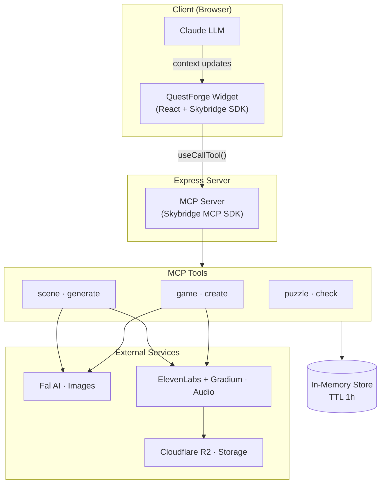

# Quest Forge — Script vidéo : Architecture

> **Format** : voix off + screencast du diagramme Mermaid ci-dessous.
> **Durée estimée** : ~3 min.
> **Ton** : technique mais accessible, comme un talk de dev.

---

## Diagramme de référence

---

## Script

### INTRO (0:00 – 0:20)

> Salut ! Aujourd'hui je vous montre l'architecture de **Quest Forge** — un visual novel conversationnel qu'on génère entièrement à la volée avec de l'IA.
>
> Le joueur discute avec des personnages, fait des choix, résout des énigmes — et tout ça tourne dans une seule app ChatGPT construite avec le framework **Skybridge**.
>
> On va parcourir le diagramme ensemble, de gauche à droite, du navigateur jusqu'aux services externes.

---

### LE CLIENT (0:20 – 0:55)

*[Highlight : bloc "Client (Browser)"]*

> Côté client, on a deux acteurs.
>
> D'abord, **Claude** — le LLM. C'est lui qui incarne les personnages du jeu. Il reçoit un system prompt avec la personnalité du PNJ, le niveau de confiance du joueur, l'état de la scène en cours, et il répond en restant dans son rôle.
>
> Ensuite, le **widget QuestForge**. C'est une app React qui s'affiche directement dans l'interface de ChatGPT grâce au SDK Skybridge. C'est lui qui gère tout le rendu visuel : les portraits, les décors, la musique, les choix narratifs, les écrans de puzzle.
>
> La communication entre les deux passe par des **context updates** : quand une nouvelle scène est générée, le widget envoie un message au LLM pour mettre à jour son contexte — et le LLM adapte ses réponses en conséquence.

---

### LE SERVEUR MCP (0:55 – 1:25)

*[Highlight : bloc "Express Server" + flèche useCallTool()]*

> Au milieu, on a un serveur **Express** classique qui expose un endpoint `/mcp`.
>
> Quand le widget a besoin de quelque chose — créer un jeu, générer une scène, vérifier une réponse de puzzle — il appelle `useCallTool()` via le SDK Skybridge. Cet appel est routé vers notre **MCP Server**, qui dispatche la requête vers le bon outil.
>
> Le protocole MCP, c'est ce qui fait le pont entre le frontend et le backend. On enregistre nos outils avec leurs schémas Zod, et Skybridge gère le transport HTTP et le typage de bout en bout.

---

### LES TROIS OUTILS (1:25 – 2:10)

*[Highlight : bloc "MCP Tools"]*

> On a trois outils, qui correspondent aux trois moments clés du jeu.

#### game · create

> Le premier, c'est **game create**. C'est le point d'entrée. Le LLM l'appelle une seule fois avec tout le concept de l'histoire : titre, genre, personnages, synopsis, scène d'ouverture, énigmes.
>
> En parallèle, cet outil lance la génération de tous les **portraits de personnages** via Fal AI, les **musiques d'ambiance** via ElevenLabs — trois morceaux par partie — et la **narration d'introduction** via Gradium. Tout ça se fait en concurrence pour minimiser le temps d'attente.
>
> Il crée ensuite la première scène et stocke le tout dans un **store en mémoire** avec un TTL d'une heure.

#### scene · generate

> Ensuite, à chaque fois que le joueur fait un choix narratif, le widget appelle **scene generate**. Cet outil récupère les données de la sortie choisie — qui contiennent déjà le setting, les PNJ présents, la situation — et il génère un nouveau **décor** avec Fal AI, une nouvelle **narration** avec Gradium, et calcule les prochaines sorties possibles en fonction du niveau de confiance et de la progression.
>
> C'est aussi lui qui injecte les **puzzles** aux scènes 2 et 4.

#### puzzle · check

> Enfin, **puzzle check** valide les réponses du joueur. Il normalise la saisie — minuscules, accents — et compare avec les réponses acceptées en appliquant une **tolérance de Levenshtein** pour les réponses courtes. Si le joueur échoue trop de fois, c'est game over — ou perte de confiance, selon la conséquence définie par le scénario.

---

### LE STORE EN MÉMOIRE (2:10 – 2:25)

*[Highlight : cylindre "In-Memory Store"]*

> Toute la donnée de jeu vit dans une **Map en mémoire** côté serveur. Chaque partie a un ID unique, et on y stocke les personnages, les scènes visitées, l'état des puzzles, les URLs des musiques générées.
>
> Le TTL est d'une heure — si le joueur ne finit pas sa partie dans ce délai, les données sont nettoyées.

---

### LES SERVICES EXTERNES (2:25 – 2:50)

*[Highlight : bloc "External Services"]*

> Et pour finir, les services externes.
>
> **Fal AI** génère toutes les images — portraits et décors — avec le modèle Flux. On lui passe une description d'apparence et un style, et on reçoit une URL d'image.
>
> **ElevenLabs** génère les musiques d'ambiance, et **Gradium** s'occupe du text-to-speech pour les narrations.
>
> Tous les fichiers audio passent par **Cloudflare R2** pour le stockage — c'est du S3-compatible, on upload le buffer et on récupère une URL publique.

---

### OUTRO (2:50 – 3:05)

> Voilà pour l'architecture de Quest Forge. Trois outils MCP, trois services d'IA, un widget React, et un LLM qui joue le rôle des personnages.
>
> Le tout donne un visual novel entièrement généré à la volée — histoire, images, musique, voix — le tout dans une conversation ChatGPT.
>
> Merci d'avoir regardé, et on se retrouve pour la suite !
